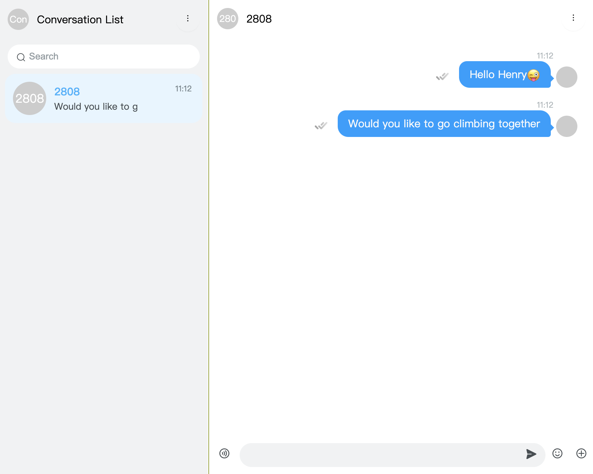

# Get Started with Agora Chat UIKit for Web

To use the UIKit 2.0 beta version, use `chatuim2` instead of `agora-chat-uikit`

```bash
npm i chatuim2 -S
```

## Overview

`agora-chat-uikit` is a UI component library based on the Chat SDK. It provides pure UI components, module components containing chat business logic, and container components, which allows users to customize using renderX method. `agora-chat-uikit` provides a provider to manage data. The provider automatically listens for chat SDK events to update data and drive UI updates. Developers can use the library to quickly build custom IM applications based on actual business requirements.

## Technical principles

UIKIt consists of three parts: UI component, mobx store for managing data, chat SDK. UI components include container components, composite Components module, and pure UI components. These components at different levels are exposed to the outside world. Users can reference any of these components to build their own applications. UIkit uses mobx to manage global data, and users can reference the rootStore to get all the data and the action method, which can be used to modify the data. UIKit integrates chat SDK internally and interacts with the server through chat SDK.

<div align=center> </div>

## Function

The `agora-chat-uikit` library provides the following functions:

- Automatic layout to match the width and height of the container;
- Send and receive messages, message display, message unread count, clear messages, message types include: (text, picture, file, expression, audio, video message);
- Search for and delete conversation.
- Customize the UI.

<table>
    <tr>
        <td>module</td>
        <td>function</td>
        <td>description</td>
    </tr>
   <tr>
      <td rowspan="5" style=font-weight:bold>Conversation List</td>
   </tr>
   <tr>
      <td>Conversation list</td>
      <td style=font-size:10px>The session list displays the profile avatar, nickname, latest message content, unread message count, and time</td>
   </tr>
   <tr>
      <td>Delete conversation</td>
      <td style=font-size:10px>Deletes the conversation from the conversation list</td>
   </tr>
   <tr>
      <td>Do not disturb (under development)</td>
      <td style=font-size:10px>Enable message do Not disturb or disable message do not disturb</td>
   </tr>
   <tr>
      <td>Top conversation (in development)</td>
      <td style=font-size:10px>Pin the conversation to the top of the list</td>
   </tr>
    <tr>
      <td rowspan="6" style=font-weight:bold>Chat</td>
   </tr>
   <tr>
      <td>Message sender</td>
      <td style=font-size:10px>Support to send text, emoji, picture, file, voice</td>
   </tr>
   <tr>
      <td>Display message </td>
      <td style=font-size:10px>Single or group chat message display, including profile avatar, nickname, message content, time, sent status, and read status. Message types include text, picture, video, file, and voice</td>
   </tr>
</table>

## Component

`agora-chat-uikit` Currently provided components:

- Container components: `Provider`， `Chat`，`ConversationList`;
- Module components: `BaseMessage`，`AudioMessage`，`FileMessage`， `VideoMessage`，`ImageMessage`，`TextMessage`，`Header`，`Empty`，`MessageList`， `ConversationItem`，`MessageEditor`，`MessageStatus`;
- Pure UI components: `Avatar`，`Badge`，`Button`，`Checkbox`，`Icon`，`Modal`，`Tooltip`;

Container components introduction:

<table>
    <tr>
        <td>Component</td>
        <td>Description</td>
        <td>Props</td>
		<td>Props Description</td>
    </tr> 
   <tr>
      <td rowspan="2" style=font-weight:bold>Provider</td>
      <td rowspan="2"  style=font-size:10px>The Provider does not render any UI but only provides global context for components. It automatically listens to SDK events, transmits data downward, and drives component rendering</td>
      <td style=font-size:10px>
      initConfig: {
        appkey: string
      }
      </td>
	  <td style=font-size:10px>You can configure appKey</td>
	   <tr>
	   <td style=font-size:10px>
	   </pre>
       local
		<pre>
      </td>
	   <td style=font-size:10px>To configure the localized copy, see the parameters of the i18next init method</td>
	   </tr>
   </tr>
   <tr>
      <td rowspan="8" style=font-weight:bold>ConversationList</td>
      <td rowspan="8"  style=font-size:10px>Conversation list component</td>
      <td style=font-size:10px>
      className
	  </td>
	  <td style=font-size:10px>
	  Component class name
	  </td>
	  <tr>
		<td style=font-size:10px>prefix</td>
		<td style=font-size:10px>css class name prefix</td>
	  </tr>
	  <tr>
		<td style=font-size:10px>headerProps</td>
		<td style=font-size:10px>Props for the Header component</td>
	  </tr>
	  <tr>
		<td style=font-size:10px>itemProps</td>
		<td style=font-size:10px>Props for the ConversationItem component</td>
	  </tr>
	   <tr>
		<td style=font-size:10px>renderHeader?: () => React.ReactNode</td>
		<td style=font-size:10px>Custom rendering header, which receives a function that returns a react node</td>
	  </tr>
	  <tr>
		<td style=font-size:10px>renderSearch?: () => React.ReactNode</td>
		<td style=font-size:10px>Custom rendering search component, which receives a function that returns a react node</td>
	  </tr>
	  <tr>
		<td style=font-size:10px>onItemClick?: (data: ConversationData[0]) => void</td>
		<td style=font-size:10px>Click on the conversation event to return the data of the current session</td>
	  </tr>
	  <tr>
		<td style=font-size:10px>onSearch?: (e: React.ChangeEvent<HTMLInputElement>) => boolean</td>
		<td style=font-size:10px>Search input change event. If the function returns false, it will prevent the default search behavior. Users can search according to their own conditions</td>
	  </tr>
   </tr>
   <tr>
      <td rowspan="9" style=font-weight:bold>Chat</td>
      <td rowspan="9" style=font-size:10px>Chat component</td>
      <td style=font-size:10px>
	  className: string
	  </td>
	  <td style=font-size:10px>
	  Component CSS class name
	  </td>
	  <tr>
	    <td style=font-size:10px>prefix: string</td>
		<td style=font-size:10px>CSS class name prefix</td>
	  </tr>
	  <tr>
	    <td style=font-size:10px>headerProps: HeaderProps</td>
		<td style=font-size:10px>props for Header</td>
	  </tr>
	  <tr>
	    <td style=font-size:10px>messageListProps: MsgListProps</td>
		<td style=font-size:10px>Props for the MessageList component</td>
	  </tr>
	  <tr>
	    <td style=font-size:10px>messageEditorProps: MessageEditorProps</td>
		<td style=font-size:10px>Props for the MessageEditor component</td>
	  </tr>
	  <tr>
	    <td style=font-size:10px>renderHeader: (cvs: CurrentCvs) => React.ReactNode</td>
		<td style=font-size:10px>Custom render Header component that takes a function that returns a react node， CurrentCvs is the current conversation</td>
	  </tr>
	   <tr>
	    <td style=font-size:10px>renderMessageList?: () => ReactNode; </td>
		<td style=font-size:10px>Custom render message list component</td>
	  </tr>
	  <tr>
	    <td style=font-size:10px>renderMessageEditor?: () => ReactNode; </td>
		<td style=font-size:10px>Custom render message sender component</td>
	  </tr>
	  <tr>
	    <td style=font-size:10px>renderEmpty?: () => ReactNode; </td>
		<td style=font-size:10px>Custom render empty pages without a conversation</td>
	  </tr>
   </tr>
</table>

## store

UIKit provides a rootStore that contains all the data. rootStore contains:

- initConfig: UIKit initializes data
- client: Chat SDK instance
- conversationStore: indicates the data related to the conversation list
- messageStore: indicates message-related data
- addressStore: indicates the address book data

<table>
    <tr>
        <td>Store</td>
        <td>Attribute/Method</td>
        <td>Description</td>
    </tr> 
    <tr>
      <td rowspan="10" >conversationStore</td>
    </<tr>
    <tr>
        <td>currentCvs</td>
        <td style=font-size:10px>Current conversation</td>
    </tr> 
    <tr>
        <td>conversationList</td>
        <td style=font-size:10px>All conversations</td>
    </tr> 
    <tr>
        <td>searchList</td>
        <td style=font-size:10px>The searched conversations</td>
    </tr> 
   <tr>
        <td style=color:blue>setCurrentCvs</td>
        <td style=font-size:10px>Set the current conversation</td>
    </tr> 
    <tr>
        <td style=color:blue>setConversation</td>
        <td style=font-size:10px>Set all conversations</td>
    </tr> 
    <tr>
        <td style=color:blue>deleteConversation</td>
        <td style=font-size:10px>Delete a conversation</td>
    </tr> 
   <tr>
        <td style=color:blue>addConversation</td>
        <td style=font-size:10px>Add a conversation</td>
    </tr> 
    <tr>
        <td style=color:blue>topConversation</td>
        <td style=font-size:10px>Top a conversation</td>
    </tr> 
    <tr>
        <td style=color:blue>modifyConversation</td>
        <td style=font-size:10px>Modifying a conversation</td>
    </tr>
     <tr>
      <td rowspan="10" >messageStore</td>
    </tr>
   <tr>
        <td>message</td>
        <td style=font-size:10px>All conversation messages, including singleChat, groupChat, byId</td style=font-size:10px>
    </tr>
   <tr>
        <td style=color:blue>currentCvsMsgs</td>
        <td style=font-size:10px>Set messages for the current conversation</td>
    </tr>
    <tr>
        <td style=color:blue>sendMessage</td>
        <td style=font-size:10px>Send a message</td>
    </tr>
    <tr>
        <td style=color:blue>receiveMessage</td>
        <td style=font-size:10px>Receive a message</td>
    </tr>
    <tr>
        <td style=color:blue>modifyMessage</td>
        <td style=font-size:10px>Edit a message</td>
    </tr>
    <tr>
        <td style=color:blue>sendChannelAck</td>
        <td style=font-size:10px>Reply with a channel ack to clear unread data from the conversation</td>
    </tr>
   <tr>
        <td style=color:blue>updateMessageStatus</td>
        <td style=font-size:10px>Update message status</td>
    </tr>
     <tr>
        <td style=color:blue>clearMessage</td>
        <td style=font-size:10px>Clear a conversation's messages</td>
    </tr>
    
</table>

## Prerequisites

In order to follow the procedure in this page, you must have:

- React 16.8.0 or later
- React DOM 16.8.0 or later
- A valid [Agora account](https://docs.agora.io/cn/AgoraPlatform/sign_in_and_sign_up).
- A valid [Agora project](https://docs.agora.io/cn/AgoraPlatform/sign_in_and_sign_up) with an App Key.

## Compatible browsers

| Browser | Supported Version |
| ------- | ----------------- |
| IE      | 11 or later       |
| Edge    | 43 or later       |
| Firefox | 10 or later       |
| Chrome  | 54 or later       |
| Safari  | 11 or later       |

## Project setup

### 1. Create a Web Chat UIKit project

```bash
# Install a CLI tool.
npm install create-react-app
# Create an my-app project.
npx create-react-app my-app
cd my-app
```

```
The project directory.

├── package.json
├── public # The static directory of Webpack.
│ ├── favicon.ico
│ ├── index.html # The default single-page app.
│ └── manifest.json
├── src
│ ├── App.css # The CSS of the app's root component.
│ ├── App.js # The app component code.
│ ├── App.test.js
│ ├── index.css # The style of the startup file.
│ ├── index.js # The startup file.
│ ├── logo.svg
│ └── serviceWorker.js
└── yarn.lock
```

### 2. Integrate the Web Chat UIKit

#### Install the Web Chat UIKit

- To install the Web Chat UIKit with npm, run the following command:

```bash
npm install agora-chat-uikit --save
```

- To Install Agora chat UIKit for Web with Yarn, run the following command:

```bash
yarn add agora-chat-uikit
```

#### Build the application using the agora-chat-uikit component

Import agora-chat-uikit into your code.

```javascript
// App.js
import React, { Component, useEffect } from 'react';
import { Provider, Chat, ConversationList, useClient, rootStore } from 'agora-chat-uikit';
import 'agora-chat-uikit/style.css';

const ChatApp = () => {
  const client = useClient();
  useEffect(() => {
    client &&
      client
        .open({
          user: '',
          agoraToken: '',
        })
        .then(res => {
          console.log('get token success', res);
          // create a conversation
          rootStore.conversationStore.addConversation({
            chatType: '', // 'singleChat' || 'groupChat'
            conversationId: '', // target user id or group id
            name: '', // target user nickname or group name
            lastMessage: {},
          });
        });
  }, [client]);

  return (
    <div>
      <div>
        <ConversationList />
      </div>
      <div>
        <Chat />
      </div>
    </div>
  );
};

class App extends Component {
  render() {
    return (
      <Provider
        initConfig={{
          appKey: 'you app key',
        }}
      >
        <ChatApp />
      </Provider>
    );
  }
}

export default App;
```

#### Run the project and send your first message

```bash
npm run start
```

Now, you can see your app in the browser.

<div align=center style="background: #ddd; padding-top: 8px"> </div>

In the default App Key situation, for the convenience of quick experience, we support several types of message distribution by default. After clicking to select a member, enter your first message and send it.

**Note**

If a custom App Key is used, no contact is available by default and you need to first [add contacts](https://docs.agora.io/en/agora-chat/client-api/contacts) or [join a group](https://docs.agora.io/en/agora-chat/client-api/chat-group/manage-chat-groups).

Agora provides an open source AgoraChat UIKit web project on GitHub, where you can clone and run the project or reference the logic to create a project that integrates agora-chat-uikit.

- [URL for Agora Chat UIKit Web source code ](https://github.com/easemob/Easemob-UIKit-web)
- [URL for Agora chat application using agora-chat-uikit](https://github.com/AgoraIO-Usecase/AgoraChat-web/tree/dev-2.0)

## How to customize

### Modify Component Style

You can modify the style by passing className, style, and prefix through the component props

```javascript
import { Chat, Button } from 'agora-chat-uikit';

const ChatApp = () => {
  return (
    <div>
      <Chat className="customClass" prefix="custom" />
      <Button style={{ width: '100px' }}>Button</Button>
    </div>
  );
};
```

### Using custom components

Custom components can be rendered through the renderX method of container components

```javascript
import {Chat, Header} from 'agora-chat-uikit'

const ChatApp = () => {
  const CustomHeader = <Header back content="Custom Header">
  return(
    <div>
      <Chat renderHeader={(cvs) => CustomHeader}>
    </div>
  )
}

```

### Modify Theme

The UIKit style is developed using the scss framework and defines a series of global style variables, including but not limited to global styles (main color, background color, rounded corners, borders, font size).

```scss
// need to use hsla
$blue-base: hsla(203, 100%, 60%, 1);
$green-base: hsla(155, 100%, 60%, 1);
$red-base: hsla(350, 100%, 60%, 1);
$gray-base: hsla(203, 8%, 60%, 1);
$special-base: hsla(220, 36%, 60%, 1);

$font-color: $gray-3;
$title-color: $gray-1;
$component-background: #fff;

$height-base: 36px;
$height-lg: 48px;
$height-sm: 28px;

// vertical margins
$margin-lg: 24px;
$margin-md: 16px;
$margin-sm: 12px;
$margin-xs: 8px;
$margin-xss: 4px;

// vertical paddings
$padding-lg: 24px;
$padding-md: 20px;
$padding-sm: 16px;
$padding-s: 12px;
$padding-xs: 8px;
$padding-xss: 4px;
// font
$font-size-base: 14px;
$font-size-lg: $font-size-base + 2px;
$font-size-sm: 12px;
$text-color: fade($black, 85%);
```

All variables can be viewed here ''

1. Use webpack for variable coverage:

```javascript
module.exports = {
  module: {
    rules: [
      {
        test: /\.s[ac]ss$/i,
        use: [
          'style-loader',
          'css-loader',
          {
            loader: 'sass-loader',
            options: {
              additionalData: `@import "@/styles/index.scss";`,
            },
          },
        ],
      },
    ],
  },
};
```

2. Customize in create-react-app

creating a scss file within variables to override style.scss. Need to ensure the order of importing files

```scss
@import 'agora-chat-uikit/style.scss'; // agora-chat-uikit theme
@import 'your-theme.scss'; // your theme
@import 'agora-chat-uikit/components.scss'; // components style
```

If these cannot meet the customization requirements, you can also find the elements to cover the style of UIKit.

## Community Contribution

If you want to add extra functions to agora-chat-uikit to share with others, you can fork our repository on GitHub and create a pull request. For any questions, please also submit it on the repository. Thank you for your contribution!

## Feedback

If you have any problems or suggestions regarding the sample projects, feel free to file an issue.

## Reference

- [Agora Chat SDK Product Overview](https://docs.agora.io/en/agora-chat/overview/product-overview)
- [Agora Chat SDK API Reference](https://api-ref.agora.io/en/chat-sdk/web/1.x/index.html)

## Related resources

- Check our [FAQ](https://docs.agora.io/en/faq) to see if your issue has been recorded.
- Dive into [Agora SDK Samples](https://github.com/AgoraIO) to see more tutorials
- Take a look at [Agora Use Case](https://github.com/AgoraIO-usecase) for more complicated real use case
- Repositories managed by developer communities can be found at [Agora Community](https://github.com/AgoraIO-Community)
- If you encounter problems during integration, feel free to ask questions in [Stack Overflow](https://stackoverflow.com/questions/tagged/agora.io)

## License

The sample projects are under the MIT license.
