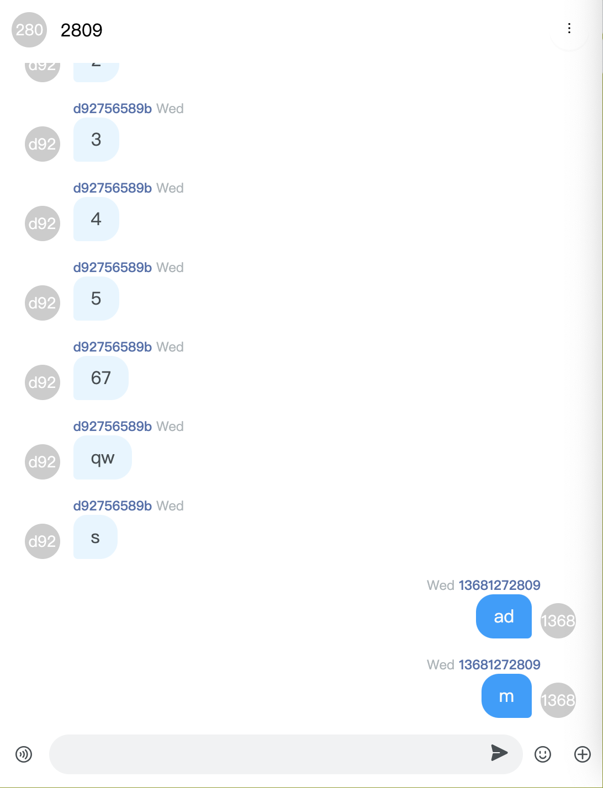
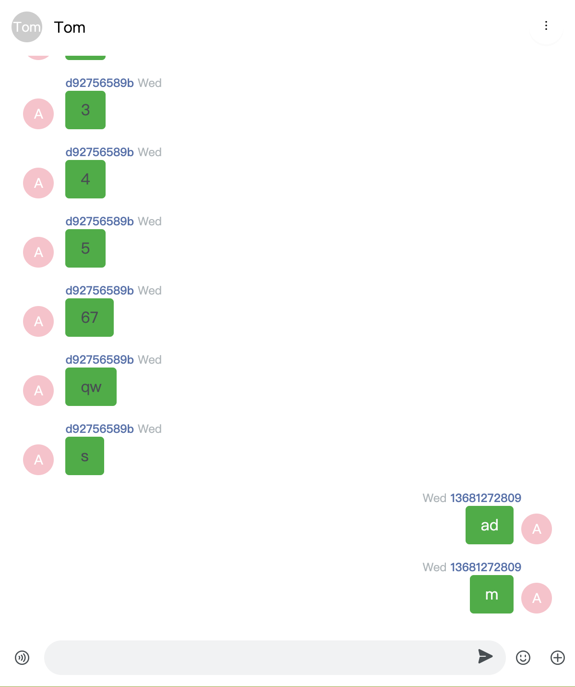
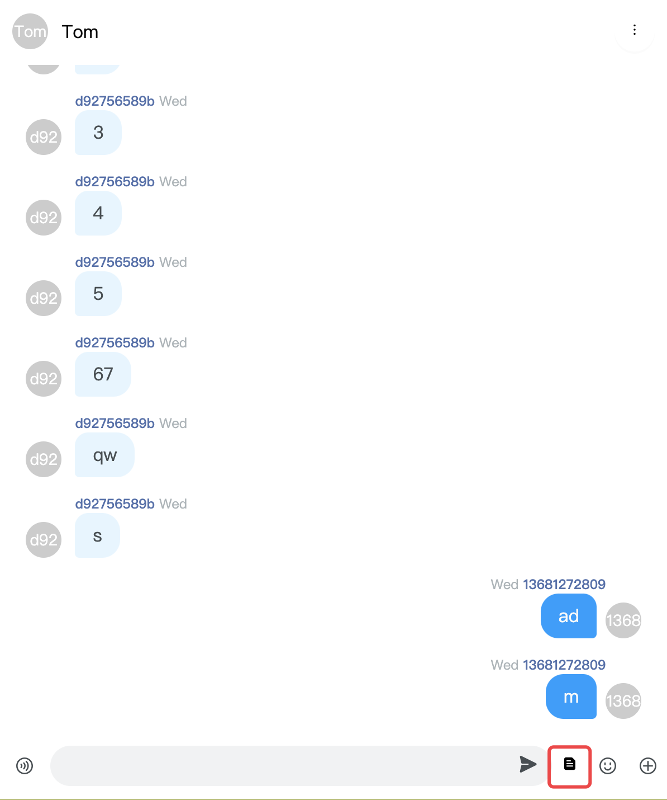
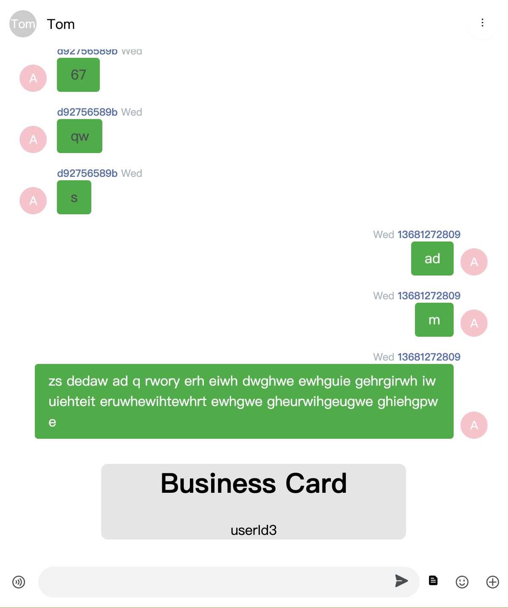

# Chat

The Chat component provides the following functions:

- Sends and receives messages, including text, emoji, image, voice, and file messages.
- Clears messages.
- Deletes a conversation.
- Uses the message roaming function to pull historical messages from the server.

## Usage example

```jsx
import React from "react";
import { Chat } from "agora-chat-uikit";
import "agora-chat-uikit/style.css";

const ChatContainer = () => {
  return (
    <div style={{ width: "70%", height: "100%" }}>
      <Chat />
    </div>
  );
};
```

<div align=center> </div>

## How to Customize Chat component

### Modify the message bubble style

Take text messages as an example. You can modify the message bubble style as follows:

- Use the `renderMessageList` method to render the custom message list.
- Use the `renderMessage` method to render custom messages.
- Customize text messages through the props of the `TextMessage` component.

```jsx
import React from "react";
import { Chat, MessageList, TextMessage } from "agora-chat-uikit";
import "agora-chat-uikit/style.css";

const ChatContainer = () => {
  const renderTxtMsg = (msg) => {
    return (
      <TextMessage
        bubbleStyle={{ background: "hsl(135.79deg 88.79% 36.46%)" }}
        shape="square"
        status={msg.status}
        avatar={<Avatar style={{ background: "pink" }}>A</Avatar>}
        textMessage={msg}
      ></TextMessage>
    );
  };

  const renderMessage = (msg) => {
    if (msg.type === "txt") {
      return renderTxtMsg(msg);
    }
  };

  return (
    <div style={{ width: "70%", height: "100%" }}>
      <Chat
        renderMessageList={() => <MessageList renderMessage={renderMessage} />}
      />
    </div>
  );
};
```

<div align=center> </div>

### Add an icon to the MessageEditor component

Add an icon to the MessageEditor component to implement a specific custom function:

1. Use the `renderMessageEditor` method to render the custom message editor component.
2. Customize `MessageEditor` with `actions` props.

```jsx
import React from "react";
import { Chat, Icon, MessageEditor } from "agora-chat-uikit";
import "agora-chat-uikit/style.css";

const ChatContainer = () => {
  // Add an icon to the message editor
  const CustomIcon = {
    visible: true,
    name: "CUSTOM",
    icon: (
      <Icon
        type="DOC"
        onClick={() => {
          console.log("click custom icon");
        }}
      ></Icon>
    ),
  };

  const actions = [...MessageEditor.defaultActions];
  // Insert a custom icon after textarea
  actions.splice(2, 0, CustomIcon);
  return (
    <div style={{ width: "70%", height: "100%" }}>
      <Chat renderMessageEditor={() => <MessageEditor actions={actions} />} />
    </div>
  );
};
```

<div align=center> </div>

### How to implement the sending of custom messages

1. Use the `sendMessage` method in `messageStore` to send custom messages.
2. Use `renderMessage` to display custom messages.

**Note：**

To make sure that the message is displayed in the current conversation, the `to` parameter in the `sendCustomMessage` method must be the user ID of the peer user for one-to-one chat or the current group ID for group chat.

```jsx
import React from "react";
import {
  Chat,
  MessageList,
  TextMessage,
  rootStore,
  MessageEditor,
  Icon,
  useChatContext,
} from "agora-chat-uikit";
import "agora-chat-uikit/style.css";

const ChatContainer = () => {
  const { sendMessage } = useChatContext();
  // Display custom messages
  const renderCustomMsg = (msg) => {
    return (
      <div>
        <h1>Business Card </h1>
        <div>{msg.customExts.id}</div>
      </div>
    );
  };
  const renderMessage = (msg) => {
    if (msg.type === "custom") {
      return renderCustomMsg(msg);
    }
  };

  // Add an icon to the message editor
  const CustomIcon = {
    visible: true,
    name: "CUSTOM",
    icon: (
      <Icon
        type="DOC"
        onClick={() => {
          sendCustomMessage();
        }}
      ></Icon>
    ),
  };
  const actions = [...MessageEditor.defaultActions];
  actions.splice(2, 0, CustomIcon);

  // Implement the sending of a custom message
  const sendCustomMessage = () => {
    const customMsg = AgoraChat.message.create({
      type: "custom",
      to: "targetId", // The user ID of the peer user for one-to-one chat or the current group ID for group chat.
      chatType: "singleChat",
      customEvent: "CARD",
      customExts: {
        id: "userId3",
      },
    });
    sendMessage(customMsg).then(() => {
      console.log("send success");
    });
  };
  return (
    <div style={{ width: "70%", height: "100%" }}>
      <Chat
        renderMessageList={() => <MessageList renderMessage={renderMessage} />}
        renderMessageEditor={() => <MessageEditor actions={actions} />}
      />
    </div>
  );
};
```

<div align=center> </div>
### Modify the theme

Chat provides the following variables related to the chat page theme. For how to modify the theme, see the [how to modify the theme](https://github.com/AgoraIO-Usecase/AgoraChat-UIKit-web/tree/UIKit-1.2/docs/en/theme.md).

```scss
$chat-bg: $component-background;
$msg-base-font-size: $font-size-lg;
$msg-base-color: $font-color;
$msg-base-margin: $margin-xs 0;
$msg-base-padding: 0 $padding-lg;
$msg-bubble-border-radius-left: 12px 16px 16px 4px;
$msg-bubble-border-radius-right: 16px 12px 4px 16px;
$msg-bubble-arrow-border-size: 6px;
$msg-bubble-arrow-bottom: 8px;
$msg-bubble-arrow-left: -11px;
$msg-bubble-arrow-right: -11px;
$msg-bubble-color-secondly: $blue-95;
$msg-bubble-color-primary: $blue-5;
$msg-bubble-font-color-secondly: $font-color;
$msg-bubble-font-color-primary: $gray-98;
$msg-base-content-margin: 0 $margin-xs 0 $margin-sm;
$msg-base-content-padding: $padding-xs $padding-sm;
$msg-base-content-minheight: 24px;
$msg-bubble-none-bg: transparent;
$msg-bubble-none-color: $font-color;
$msg-bubble-square-border-radius: 4px;
$msg-info-margin-left: $margin-sm;
$msg-nickname-font-size: $font-size-sm;
$msg-nickname-font-weight: 500;
$msg-nickname-font-color: #5270ad;
$msg-nickname-height: 16px;
$msg-time-font-size: $font-size-sm;
$msg-time-font-weight: 400;
$msg-time-font-color: $gray-7;
$msg-time-height: 16px;
$msg-time-margin: 0 $margin-xss;
$msg-time-width: 106px;
```

## Overview of Chat props

<table>
<tr>
        <td>Props</td>
        <td>Type</td>
        <td>Description</td>
    </tr>
 <tr>
      <td style=font-size:10px>
	className
	  </td>
      <td style=font-size:10px>
	String
	  </td>
	  <td style=font-size:10px>
	  Component CSS class name
	  </td>
	  <tr>
	    <td style=font-size:10px>prefix</td>
        <td style=font-size:10px>String</td>
		<td style=font-size:10px>The prefix of the CSS class name</td>
	  </tr>
	  <tr>
	    <td style=font-size:10px>headerProps</td>
        <td style=font-size:10px>HeaderProps</td>
		<td style=font-size:10px>props for Header</td>
	  </tr>
	  <tr>
	    <td style=font-size:10px>messageListProps</td>
        <td style=font-size:10px>MsgListProps</td>
		<td style=font-size:10px>Props for the MessageList component</td>
	  </tr>
	  <tr>
	    <td style=font-size:10px>messageEditorProps</td>
        <td style=font-size:10px> MessageEditorProps</td>
		<td style=font-size:10px>Props for the MessageEditor component</td>
	  </tr>
	  <tr>
	    <td style=font-size:10px>renderHeader</td>
        <td style=font-size:10px>(cvs: CurrentCvs) => React.ReactNode</td>
		<td style=font-size:10px>Renders the custom Header component</td>  
	  </tr>
	   <tr>
	    <td style=font-size:10px>renderMessageList</td>
        <td style=font-size:10px>() => ReactNode; </td>
		<td style=font-size:10px>Renders the custom message list component</td>
	  </tr>
	  <tr>
	    <td style=font-size:10px>renderMessageEditor </td>
         <td style=font-size:10px>() => ReactNode; </td>
		<td style=font-size:10px>Renders the custom message sender component</td>
	  </tr>
	  <tr>
	    <td style=font-size:10px>renderEmpty</td>
        <td style=font-size:10px>() => ReactNode; </td>
		<td style=font-size:10px>Renders the custom empty page without a conversation</td>  
	  </tr>
   </tr>
</table>
