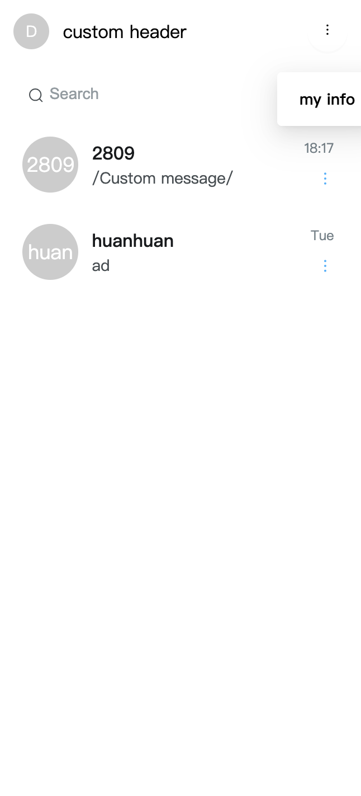

# ConversationList

`ConversationList` 组件用来展示当前用户的所有会话 (包含一对一单聊和群聊, 但是不包括聊天室)，并且提供搜索，删除，置顶，免打扰功能。 对于单聊, 会话展示出的名称是对方的昵称，如果对方没有设置昵称则展示对方的 user ID，会话头像是对方的头像，如果没有设置则使用默认头像。 对于群聊会话名称是当前群组的名称，头像是默认头像。

## 使用示例

```jsx
import React, { useEffect, useState } from 'react';
import { ConversationList } from 'easemob-chat-uikit';
import 'easemob-chat-uikit/style.css';

const Conversation = () => {
  return (
    <div style={{ width: '30%', height: '100%' }}>
      <ConversationList />
    </div>
  );
};
```

<div align=center > </div>

## 自定义会话列表

如果默认的 `ConversationList` UI 不能满足需求，你可以 `ConversationList` 组件提供的 props 来进行自定义。

### 自定义组件的背景颜色，大小等样式。

给组件添加 `className` 来定义样式

```jsx
import React from 'react';
import { ConversationList } from 'easemob-chat-uikit';
import 'easemob-chat-uikit/style.css';
import './index.css';

const Conversation = () => {
  return (
    <div style={{ width: '30%', height: '100%' }}>
      <ConversationList className="conversation" />
    </div>
  );
};
```

Define the conversation UI style in index.css:

```css
.conversation {
  background-color: '#03A9F4';
  height: 100%;
  width: 100%;
}
```

<div align=center > </div>

### 自定义 `ConversationList` 组件的 header 元素。

```jsx
import React from 'react';
import { ConversationList, Header, Avatar } from 'easemob-chat-uikit';
import 'easemob-chat-uikit/style.css';

const Conversation = () => {
  return (
    <div style={{ width: '30%', height: '100%' }}>
      <ConversationList
        renderHeader={() => (
          <Header
            avatar={<Avatar>D</Avatar>}
            content="custom header"
            moreAction={{
              visible: true,
              actions: [
                {
                  content: 'my info',
                  onClick: () => {
                    console.log('my info');
                  },
                },
              ],
            }}
          />
        )}
      ></ConversationList>
    </div>
  );
};
```

<div align=center > </div>

### 设置用户的头像和昵称。

- 使用 `renderItem` 方法来渲染每个会话条目。
- 使用 `ConversationItem` 组件的 props 来自定义组件。

```jsx
import React from 'react';
import { ConversationList, ConversationItem, Avatar } from 'easemob-chat-uikit';
import 'easemob-chat-uikit/style.css';
import './index.css';

const Conversation = () => {
  // Maps the user ID of the peer user in the one-to-one chat to the nickname of the peer user.
  const idToName = {
    userId1: 'name1',
    zd2: 'Henry 2',
  };
  return (
    <div style={{ width: '30%', height: '100%' }}>
      <ConversationList
        className="conversation"
        renderItem={cvs => {
          return (
            <ConversationItem
              avatar={
                <Avatar
                  size="normal"
                  shape="square"
                  style={{ background: 'yellow', color: 'black' }}
                >
                  {idToName[cvs.conversationId] || cvs.conversationId}
                </Avatar>
              }
              data={{
                ...cvs,
                name: idToName[cvs.conversationId] || cvs.conversationId,
              }}
            />
          );
        }}
      ></ConversationList>
      />
    </div>
  );
};
```

<div align=center > </div>

### 自定义日期时间格式

```jsx
<ConversationList
  itemProps={{
    formatDateTime: (time: number) => {
      // 将 time 时间戳格式化成自己需要的格式
      return new Date(time).toLocaleString();
    },
  }}
/>
```

### 自定义更多操作功能

通过配置 itemProps 的 moreAction 属性来控制显示哪些功能，或者添加自定义功能

```jsx
<ConversationList
  itemProps={{
    moreAction: {
      visible: true, // 是否显示更多操作
      actions: [
        {
          content: 'DELETE', // 删除功能
        },
        {
          content: 'PIN', // 置顶功能
        },
        {
          content: 'SILENT', // 免打扰功能
        },
        {
          content: '自定义功能',
          onClick: () => {},
          icon: <Icon type="STAR" />,
        },
      ],
    },
  }}
/>
```

### 自定义会话最后一条消息内容

通过设置 itemProps 中 renderMessageContent 方法来返回自定义消息内容

```jsx
<ConversationList
  itemProps={{
    renderMessageContent: message => {
      return <div>自定义消息内容</div>;
    },
  }}
/>
```

### 自定义消息未读数气泡颜色，头像大小，形状

通过设置 itemProps 属性控制 ConversationItem 样式

```jsx
<ConversationList
  itemProps={{
    badgeColor: 'red', // 气泡颜色
    avatarSize: 50, // 头像大小
    avatarShape: 'circle', // 头像形状
  }}
/>
```

renderMessageContent

### 使用 `conversationStore` 上提供的方法, 例如:

- 使用 `topConversation` 方法置顶一个会话。
- 使用 `addConversation` 方法添加一个会话。

```jsx
import React from 'react';
import { ConversationList, ConversationItem, rootStore, Button } from 'easemob-chat-uikit';
import 'easemob-chat-uikit/style.css';

const Conversation = () => {
  // Pins a conversation.
  const topConversation = () => {
    rootStore.conversationStore.topConversation({
      chatType: 'singleChat', // For group chats, the value is `groupChat`.
      conversationId: 'userID', // Enter a conversation ID obtained from your conversation list.
      lastMessage: {},
    });
  };

  // Creates a new conversation.
  const createConversation = () => {
    rootStore.conversationStore.addConversation({
      chatType: 'singleChat',
      conversationId: 'conversationId',
      lastMessage: {},
      unreadCount: 3,
    });
  };
  return (
    <div style={{ width: '30%', height: '100%' }}>
      <ConversationList
        renderItem={cvs => {
          return (
            <ConversationItem
              moreAction={{
                visible: true,
                actions: [
                  {
                    // UIKit provides the conversation deletion event by default.
                    content: 'DELETE',
                  },
                  {
                    content: 'Top Conversation',
                    onClick: topConversation,
                  },
                ],
              }}
            />
          );
        }}
      ></ConversationList>
      <div>
        <Button onClick={createConversation}>create conversation</Button>
      </div>
    </div>
  );
};
```

<div align=center > </div>

5. 修改 `ConversationList` 的主题

`ConversationList` 组件提供了以下与会话列表页面主题相关的变量，关于怎样修改主题请查看 [Github URL](https://github.com/easemob/Easemob-UIKit-web/blob/dev/docs/theme.md)。

```scss
// Variables used to set the conversation theme.
$cvs-background: $component-background;
$cvs-search-margin: $margin-xs $margin-sm;
$cvs-item-height: 74px;
$cvs-item-padding: $padding-s;
$cvs-item-border-radius: 16px;
$cvs-item-margin: $margin-xss $margin-xs;
$cvs-item-selected-bg-color: #e6f5ff;
$cvs-item-selected-name-color: $blue-6;
$cvs-item-hover-bg-color: $gray-98;
$cvs-item-active-bg-color: $gray-9;
$cvs-item-info-right: 16px;
$cvs-item-name-margin: 0 $margin-sm;
$cvs-item-name-font-size: $font-size-lg;
$cvs-item-name-font-weight: 500;
$cvs-item-name-color: $title-color;
$cvs-item-message-margin-left: $margin-sm;
$cvs-item-message-font-size: $font-size-base;
$cvs-item-message-font-weight: 400;
$cvs-item-message-color: $font-color;
$cvs-item-time-font-weight: 400;
$cvs-item-time-font-size: $font-size-sm;
$cvs-item-time-color: $gray-5;
$cvs-item-time-margin-bottom: 9px;
```

## ConversationList props 总览

<table>
    <tr>
        <td>参数</td>
        <td>类型</td>
        <td>描述</td>
    </tr>
    <tr>
     <td style=font-size:10px>
    className
	  </td>
      <td style=font-size:10px>
    String
	  </td>
	  <td style=font-size:10px>
	  组件的类名
	  </td>
	  <tr>
		<td style=font-size:10px>prefix</td>
        <td style=font-size:10px>String</td>
		<td style=font-size:10px>CSS 类名的前缀</td>
	  </tr>
	  <tr>
		<td style=font-size:10px>headerProps</td>
        <td style=font-size:10px>HeaderProps</td>
		<td style=font-size:10px>Header 组件的参数</td>
	  </tr>
	  <tr>
		<td style=font-size:10px>itemProps</td>
        <td style=font-size:10px>ConversationItemProps</td>
		<td style=font-size:10px>ConversationItem 组件的参数</td>
	  </tr>
	   <tr>
		<td style=font-size:10px>renderHeader</td>
        <td style=font-size:10px>() => React.ReactNode</td>
		<td style=font-size:10px>自定义渲染 Header 组件的方法</td> 
	  </tr>
	  <tr>
		<td style=font-size:10px>renderSearch</td>
        <td style=font-size:10px>() => React.ReactNode</td>
		<td style=font-size:10px>自定义渲染 Search 组件的方法</td> 
	  </tr>
	  <tr>
		<td style=font-size:10px>onItemClick</td>
        <td style=font-size:10px>(data: ConversationData[0]) => void</td>
		<td style=font-size:10px>点击会话列表中每个会话的回调事件</td> 
	  </tr>
	  <tr>
		<td style=font-size:10px>onSearch</td>
        <td style=font-size:10px>(e: React.ChangeEvent<HTMLInputElement>) => boolean</td>
		<td style=font-size:10px> 搜索输入框的 change 事件，当函数返回 false 时，会组织默认的搜索行为，你可以使用自己的搜索条件来搜索</td>
	  </tr>
   </tr>
</table>
