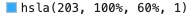

# 主题

Chat UIKit 内置浅色和深色主题，默认为浅色主题。

## 浅色和深色主题切换

```jsx
import { UIKitProvider } from 'easemob-chat-uikit';

const App = () => {
  return (
    <UIKitProvider
      theme={{
        mode: 'light', // light or dark
      }}
    ></UIKitProvider>
  );
};
```

## 自定义 primary color

默认情况 Chat UIKit 中 primary color 为 ，主要用在默认头像颜色，消息气泡颜色，按钮颜色等地方，可以自定义为其他颜色

```javascript
import { UIKitProvider } from 'agora-chat-uikit';

const App = () => {
  return (
    <UIKitProvider
      theme={{
        primaryColor: '#00CE76', // 16进制颜色值
      }}
    ></UIKitProvider>
  );
};
```

## 设置组件形状

默认组件为大圆角形状，可以设置 componentsShape 改变消息气泡，头像，输入框的圆角

```javascript
import { UIKitProvider } from 'easemob-chat-uikit';

const App = () => {
  return (
    <UIKitProvider
      theme={{
        componentsShape: 'square', // square or ground
      }}
    ></UIKitProvider>
  );
};
```

## 设置 SCSS 变量（不推荐）

Chat UIKit 内部使用的 scss，并定义了一些全局变量，如果你的项目也使用 scss，可以覆盖定义的这些变量来修改主题

你可以查看定义的变量 [here](https://github.com/easemob/Easemob-UIKit-web/blob/dev/common/style/themes/default.scss).

下面介绍了怎么修改这些变量.

### 在 create-react-app 项目中修改 scss 变量。

在使用 create-react-app 创建的项目中，你可以创建一个 SCSS 文件用来覆盖默认的变量，在下面的示例中我们将创建的文件命名为 `your-theme.scss`， 然后按照相面的顺序引入文件。

```scss
@import 'easemob-chat-uikit/style.scss'; // Theme of easemob-chat-uikit
@import 'your-theme.scss'; // Your theme file
@import 'easemob-chat-uikit/components.scss'; // Styles of UIKit components
```

### 通过修改 Webpack 配置来覆盖 SCSS 变量

配置 SCSS loader 来自动引入 style.scss 文件.

```javascript
module.exports = {
  module: {
    rules: [
      {
        test: /\.s[ac]ss$/i,
        use: [
          'style-loader',
          'css-loader',
          {
            loader: 'sass-loader',
            options: {
              additionalData: `@import "@/styles/index.scss";`,
            },
          },
        ],
      },
    ],
  },
};
```
